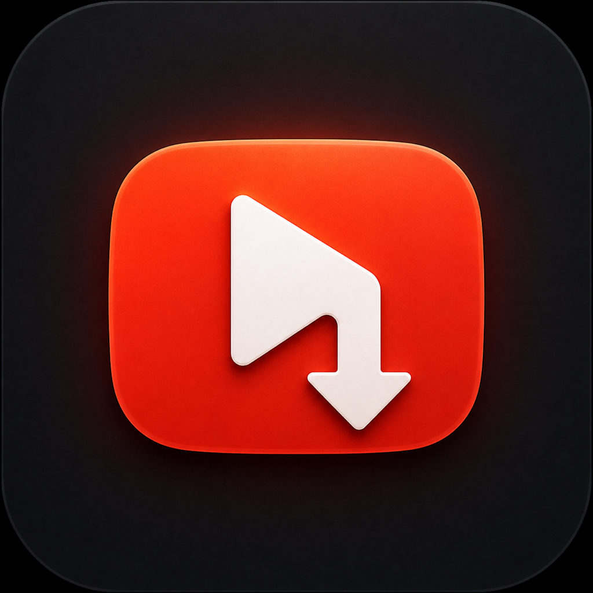

<p align="center">
  
</p>

<h1 align="center">YTGrab</h1>

<p align="center">
  A native macOS app for saving YouTube videos as edit-ready MP4 files, or just the audio.
</p>

<p align="center">
  
  
  
  
</p>

YTGrab is a CRIT Studio product. Paste a link, pick what you want, and get a
file you can drop straight onto a Premiere or Final Cut timeline. It runs
natively on Apple silicon and Intel Macs and adapts to the machine it is
installed on: the media engine where there is one, the CPU where there isn't.

## Install the app

1. Download `YTGrab-2.0-Universal.dmg` from the [latest release](../../releases/latest).
2. Open the DMG and drag **YTGrab** into **Applications**.
3. Open YTGrab from the Applications folder.

> [!NOTE]
> This build is not notarized by Apple yet, so macOS asks you to confirm it
> once. On macOS 15 and later: open YTGrab, click **Done** on the warning,
> then go to **System Settings › Privacy & Security**, scroll down and click
> **Open Anyway**. On macOS 13 and 14 you can also Control-click the app and
> choose **Open**.
>
> If macOS says the app "is damaged", run this once in Terminal:
> `xattr -dr com.apple.quarantine /Applications/YTGrab.app`

## Using it

1. **Paste a link** (or drag it onto the window, or press ⇧⌘V). YTGrab reads
   what that video actually offers: resolutions, codecs, frame rate, HDR,
   size.
2. **Pick what to save:**
   - **Edit-ready MP4**: H.264, opens in every editor. When YouTube already
     has H.264 at your chosen quality (up to 1080p on most videos), it is
     saved directly, with no conversion and no quality loss.
   - **Compact MP4**: H.265, about half the size. Can keep HDR in 10-bit.
   - **Original**: YouTube's own stream with no re-encode. Fastest, but VP9
     and AV1 files may not open in Premiere or Final Cut.
   - **Audio · M4A** or **Audio · MP3**.
3. **Press Download** (⌘↩). The job joins the queue below, and you can paste
   the next link straight away.

Playlists, channel pages and several links pasted at once all work; each
video becomes its own item in the queue. Every item shows its step, progress,
speed and time left, and has Retry, Show in Finder and a full log.

If something fails, YTGrab says why in plain words and offers the fix as a
button: update the download engine, use your browser's sign-in, repair the
built-in tools, or choose another folder. Common fixes are applied
automatically once before you ever see an error.

## Troubleshooting

| What you see | What to do |
| --- | --- |
| "YouTube wants you to sign in" / "not a bot" | **Settings › YouTube Access**: choose the browser you use YouTube in. Also needed for age-restricted and members-only videos. |
| "YouTube changed something" | YTGrab updates its download engine and retries automatically. You can also use **YTGrab › Check for Tool Updates…** or switch to the **Nightly** channel for the fastest fixes. |
| "macOS stopped a helper tool" | Click **Repair Tools**. This reinstalls the built-in tools from the app without macOS's quarantine flag. |
| Safari sign-in doesn't work | Safari keeps its cookies in a protected folder. Give YTGrab **Full Disk Access** in Privacy & Security, or pick another browser. |
| "Can't write to that folder" | Choose another folder, or allow YTGrab in **Privacy & Security › Files and Folders**. |
| Very slow conversions on an Intel Mac | Use **Edit-ready MP4** (Intel Macs without an H.265 encoder have to convert H.265 on the CPU) or **Original**. |
| Network errors on some Wi-Fi or VPNs | Turn on **Force IPv4** in Settings › YouTube Access. |

Each queue item's **Copy Log** button gives the full yt-dlp and ffmpeg output
for a bug report.

## How it adapts to your Mac

`SystemProfile.swift` checks the hardware once at launch, and
**Settings › This Mac** shows what it found.

- **Encoder.** Automatic uses VideoToolbox when the Mac has a hardware encoder
  for the codec and x264/x265 otherwise. Software presets scale with the core
  count, so an older dual-core Mac isn't sent to `slow`.
- **Quality mode.** VideoToolbox constant-quality only exists on Apple
  silicon. Intel Macs go straight to a resolution- and frame-rate-aware
  bitrate instead of failing and retrying.
- **Source codec.** Without hardware AV1 decode (anything before M3), YTGrab
  asks YouTube for VP9 instead of AV1 when it will convert anyway, which
  decodes several times faster. Hardware decode is used when the Mac has it.
- **Fallbacks.** Each conversion has a chain: media engine with hardware
  decode, without it, bitrate mode, then the software encoder. A job only
  fails if all of them do.
- **Tools.** The app ships universal binaries but installs only your Mac's
  slice into Application Support, saving several hundred MB.
- **Concurrency.** The default number of simultaneous downloads follows the
  chip (two on Pro/Max-class Apple silicon, one elsewhere).

While jobs run, YTGrab keeps the Mac from idling to sleep and stops App Nap
from throttling it. It shows a Dock badge and a notification when a
background download finishes.

## Build from source

```bash
open YTGrab.xcodeproj
```

Press Run. The first build runs `Scripts/fetch-tools.sh`, which downloads
yt-dlp, Deno, FFmpeg and FFprobe for **both** Apple silicon and Intel,
verifies their SHA-256 checksums, combines each pair into a universal binary
with `lipo`, and places them in `YTGrab/Tools`. Later builds skip this unless
`Scripts/tools.lock` changes. The binaries are not committed; universal
FFmpeg and Deno are larger than GitHub's 100 MB file limit.

To build a release DMG:

```bash
./Scripts/build-release.sh          # → build/YTGrab-<version>-Universal.dmg
```

GitHub Actions (`.github/workflows/build.yml`) does the same on every push.
It checks that the app and all four tools contain both architectures, runs
each tool, and uploads the DMG as an artifact. Pushing a `v*` tag attaches
the DMG to a GitHub release.

### Updating the embedded tools

Edit `Scripts/tools.lock` with the new version and its checksum from the
official release page, then rebuild. FFmpeg URLs without a pinned hash are
checked against the server's published `.sha256`, and the script prints the
hash so you can pin it.

Inside the app, yt-dlp and Deno update themselves from the official GitHub
releases (checked against the published SHA-256 digest) at most once a day.
FFmpeg stays pinned to the app release so encoder behaviour cannot change
underneath a job. When a newer app ships newer tools, they replace older
managed copies automatically.

### Signing and notarization

The project signs ad-hoc (`CODE_SIGN_IDENTITY = "-"`) so it builds without a
developer account. That is why users see the Gatekeeper prompt. For a smooth
public release:

1. Join the Apple Developer Program and create a **Developer ID Application**
   certificate.
2. Enable Hardened Runtime. Deno needs the `com.apple.security.cs.allow-jit`
   and `allow-unsigned-executable-memory` entitlements, and the embedded tools
   must be re-signed with the same identity and `--options runtime`.
3. `SIGN_IDENTITY="Developer ID Application: …" ./Scripts/build-release.sh`,
   then `xcrun notarytool submit build/*.dmg --wait` and
   `xcrun stapler staple build/*.dmg`.

The App Sandbox stays off because the app launches, and updates, executable
tools in Application Support.

## Files

| File | What it does |
| --- | --- |
| `YTGrabApp.swift` | App entry, menus, quit protection, background tool updates |
| `ContentView.swift` | Main window: link bar, preview, format tiles, queue, footer |
| `Components.swift` | Shared UI pieces |
| `SettingsView.swift` | Settings window and the shared fix actions |
| `LinkInspector.swift` | Finds links in pasted text and reads what a video or playlist offers |
| `DownloadQueue.swift` | Queue, concurrency, auto-repair/auto-update retries, notifications |
| `JobPipeline.swift` | One job: download → inspect → copy or convert → move into place |
| `CommandBuilder.swift` | Every yt-dlp and ffmpeg argument, as pure functions |
| `FailureAdvisor.swift` | Turns errors and logs into a plain explanation and a fix |
| `SystemProfile.swift` | Hardware and VideoToolbox capability detection |
| `ToolLocator.swift` | Installs, thins, de-quarantines and versions the managed tools |
| `ToolUpdateManager.swift` | Verified yt-dlp and Deno updates |
| `ProcessRunner.swift` | Runs tools, streams output, timeouts and cancellation |
| `Models.swift`, `AppSettings.swift` | Data types and stored preferences |
| `Brand.swift`, `BrandViews.swift` | Design tokens and the About panel |

## What it handles for you

- HEVC output gets the `hvc1` tag, without which QuickTime and Premiere
  refuse the file.
- Colour primaries, transfer and matrix are carried over from the source. HDR
  is never mislabelled on SDR output; edit-ready output uses YouTube's SDR
  rendition of HDR videos.
- Opus audio, which MP4 can't carry, becomes AAC at 256k (384k for
  surround). AAC and MP3 sources are copied untouched.
- File names are cut by bytes, not characters, so long Tamil, Hindi, Japanese
  or emoji titles never exceed macOS's 255-byte limit.
- Work happens in a private scratch folder on the destination volume. Only a
  finished file is moved into place, so cancelling never leaves a broken
  video behind. Free space is checked before a large download starts.
- `--ignore-config` keeps a personal yt-dlp config file from changing what
  the app does.

## Third-party licenses

Embedding the tools makes their notices part of the distribution. The app's
Help menu includes **Embedded Tools & Licenses**, and the source notices live
under `YTGrab/Licenses`.

- yt-dlp: The Unlicense
- Deno: MIT
- the bundled FFmpeg/FFprobe builds: GNU GPL v3 or later

The GPL text and FFmpeg build notes are included, and the build writes
`Tools/README.txt` into the app with the exact source URL and checksum of
every embedded binary (Apple silicon FFmpeg comes from Martin Riedl's build
server; the Intel FFmpeg may come from evermeet.cx, so check its notice too). Review the obligations for your distribution
model before publishing the app; the source project does not turn third-party
code into CRIT Studio property.

## Branding

`Brand.swift` is the design system. Colours are sampled off the supplied mark
rather than eyeballed. Because the mark carries a gradient, the warm range is
kept as four stops instead of one flat red: `#A40A02` in the shadowed leg,
`#EA3318` across the body, `#F7551F` on the lit edge, `#FA7937` on the folded
corner. Surfaces come from the plate the mark sits on: `#0E0F12`, `#16171B`,
`#211F22`.

Nothing else in the app hardcodes a colour, so editing those constants
restyles the whole thing. Primary buttons use `Brand.accentFill`, a gradient
running on the same axis as the light in the mark, so the chrome and the icon
agree rather than merely sitting near each other.

The YTGrab icon source PNG lives in `Design/app-icon-source.png` for future
regeneration. The original CRIT studio mark is preserved separately in
`Design/CRIT-logo-source.png` and appears only in the compact About panel.

`BrandViews.swift` has the compact About panel. The main window uses the YTGrab
video/download icon, while the CRIT studio mark is deliberately confined to
About.

### Swapping the logo

```bash
./install-icon.sh ~/path/to/logo.png
```

Square PNG, 1024px or larger. It rebuilds all ten sizes macOS wants and
rewrites the asset manifest without changing the CRIT mark used by About. Clean
the build folder in Xcode afterwards, since the icon cache is stubborn.

## Responsible use

Download only content you own or have permission to save. You are responsible
for following applicable laws, copyright rules and the terms of service of the
websites you use.

## License

YTGrab is available under the [MIT License](LICENSE). Copyright © 2026
Kamalanarayanan, CRIT Studio. Bundled tools remain subject to their respective
third-party licenses.
